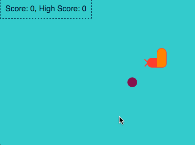

## Basic Snake Game written in TypeScript
Just for fun. It's written in vanilla js, no libraries used. Also it uses HTML elements to render the game instead of canvas.

[Demo](http://codepen.io/serkanyersen/pen/bpOWwE?editors=0010)

## Controls
 - User arrow keys to move arround
 - `G` = Show Grid
 - `C` = No Clip Mode, go through self and walls
 - `J` = Slow down the snake
 - `K` = Speed up the snake
 - `SPACE` = Pause, Resume game
 - `RETURN` = start the game
 - `1 - 4` = Change levels
 - `0` remove level
 
 

## Development
 - Checkout the project and CD into it
 - run `npm install` to get all dependencies
 - run `npm run build` to compile the app
 - run `npm start` to get the game running on your browser
